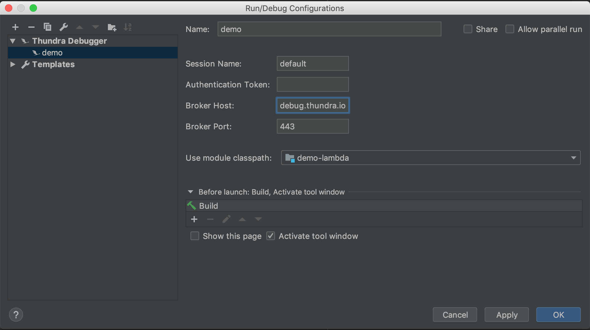

# Thundra Debugger
<em>Issue repository for Thundra Debugger Intellij Plugin</em>

Start online debug sessions while the AWS Lambda functions run on AWS Cloud. Thundra sets up an easy and secure connection between your AWS Lambda functions and Intellij IDEA. Debug your serverless applications natively with their own permissions. Stop mocking resources and simulating the environments! Put breakpoints and pause the execution of the Java functions to see the stack trace.

## Installation

* Install the extension from the marketplace. 
* [Sign up](https://console.thundra.io/signup) for Thundra and select Thundra Debugger to get your authentication key. If you’ve already signed up, you can get your key from the settings page. 
* Click on `Run - Edit Configurations` and click the add button for new configuration. 
* Select Thundra Debugger for the new configuration. 
* Set your authentication key to variable Authentication Token on the configuration modal. Enter a name for this new profile and save.

## How to use
* Set a debug point on your AWS Lambda function. 
* Select a profile from the Run Configurations dropdown. 
* Click on the Debug button to start debug session with selected profile. 
* Now invoke your AWS Lambda function to hit on the debug point. 
* Debug session ends when your AWS Lambda function times out. You can update the timeout of your function for longer debug sessions. 

#### To manage your Thundra Debugger profiles: 
* Select Run - Edit Configurations.
* Select a profile from the Run Configurations dropdown.
* Click on Thundra debugger and add a new configuration.
* Enter a new name for the profile and save. Your saved profiles will be listed under Run configurations.

## Documentation
Please see the [Thundra Documentation for Intellij Plugin](https://docs.thundra.io/ide-integrations/intellij-plugin/) for more details.

## Issues
Issues can be reported through the [Thundra Debugger Issue Repository](https://github.com/thundra-io/thundra-intellij-issues).
